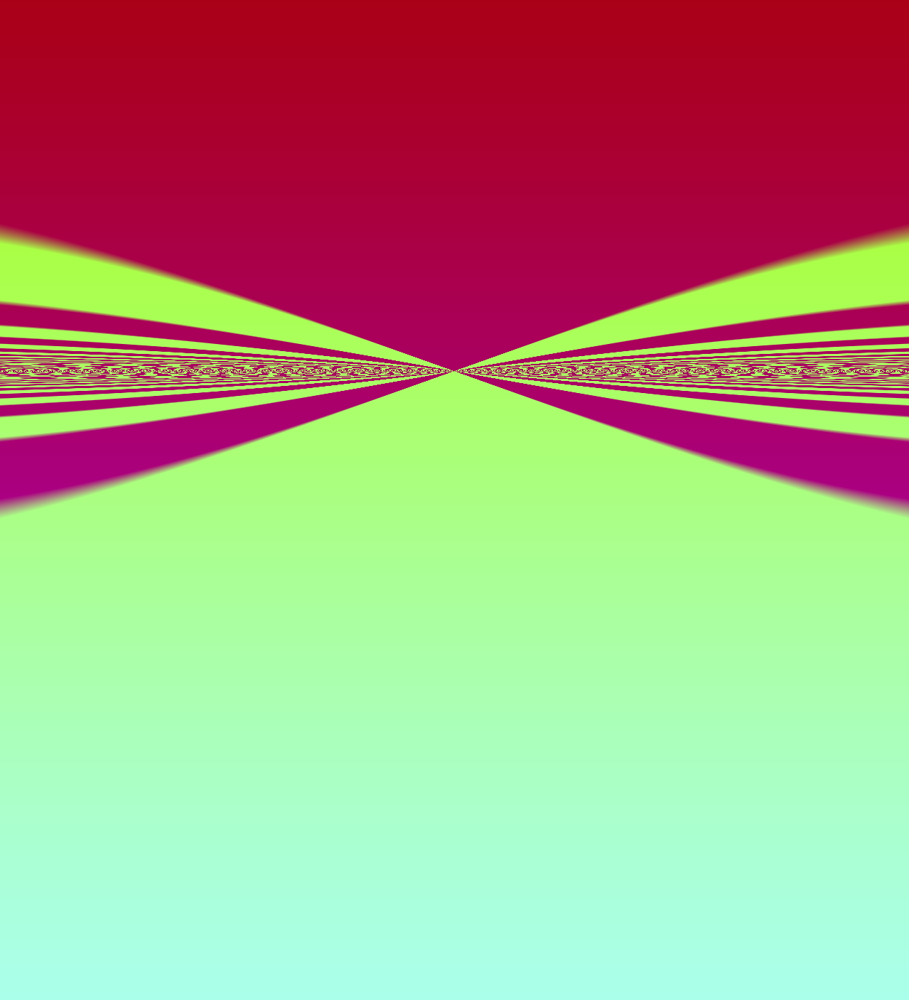
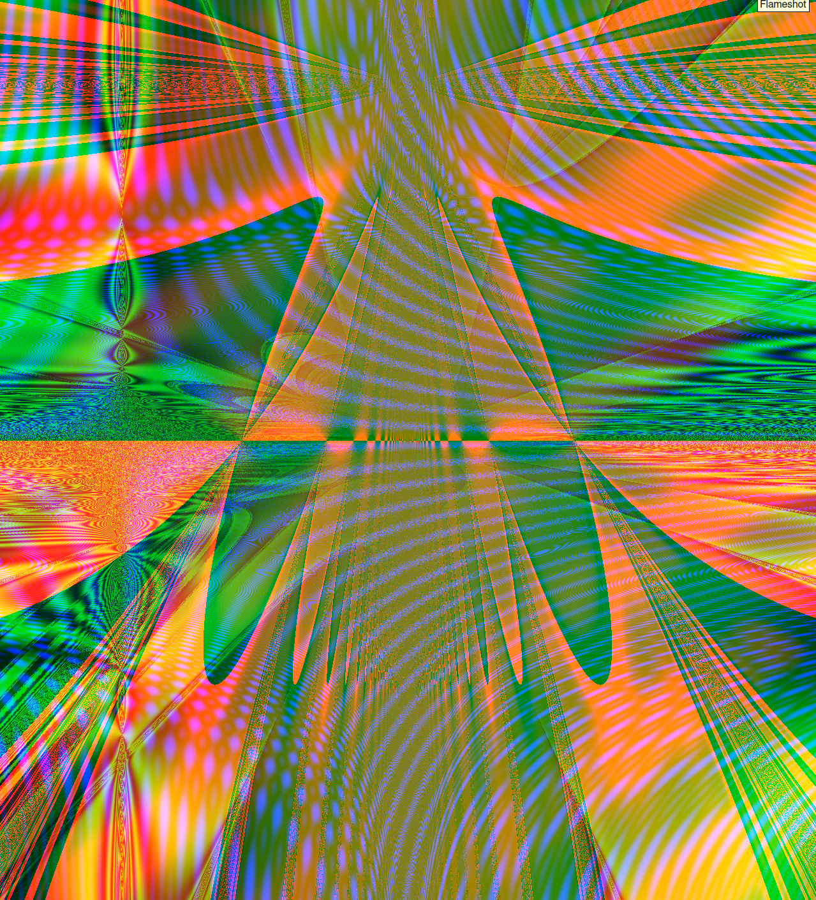

# Random art

- [Paper](https://users.ece.cmu.edu/~adrian/projects/validation/validation.pdf)


```c
rgb(0.33401775,(sin((sin(x)/(y+time())))/(time()*x)),sin(y))
```

```c
rgb(((x/sin((sin((sin(((sin((time()*y))/0.74762464)/time()))/sin((((sin(y)+time())/(-0.2301138+(x/x)))/(sin(x)/-1.36763239)))))/-0.19032598)))+(x*sin(sin(sin(sin((((((0.27443624/time())+0.94102228)*-15.6510639)+x)*((((x+y)+(0.24335277+x))/-1.28735638)+x)))))))),(sin((((((sin(((0.6748817/sin(y))/-0.44604373))*((((-0.23249161+x)/0.5702704)*sin(sin(x)))*sin(sin((time()+0.36461878)))))/sin(((-1.36372197*sin(sin(y)))*((sin(x)+(0.86042559/x))/time()))))*((((((0.91123748+y)+-0.63547248)+(y*-0.1830596))*((time()*0.077993035)*y))+(((0.3803733/(x/x))*sin((time()/y)))/(((time()+x)*10.154724)/(x/0.047968864))))+(x+((sin(sin(y))+sin((-0.5293834/time())))*sin(((0.07272887/x)*-0.61625338))))))*(sin(x)/(y/(sin(sin((y/-0.18470716)))+(((y*sin(y))+sin(sin(x)))+-0.088571906)))))+sin((x/(sin(((sin((x/y))+((-0.166574478+time())*(0.17662966/x)))/sin((x+(0.32164896+y)))))/sin((((-0.66059327+(time()/0.36048567))+-0.57564235)+(-1.12209988*x))))))))*sin(sin(x))),sin((-0.79978263+((sin((((sin((1.104531/(0.78024209/y)))/-0.008986473)/(time()+0.04727578))*(time()+x)))/-0.8696469)+sin((((((x*((y/0.73891878)/(y/-0.78274)))/((sin(y)*0.78071439)*sin((0.44309556*x))))*sin((((y+time())/(y*-0.9621428))*(1.08914137*(0.078951/y)))))+(0.68278569+x))*((sin(sin(((time()*time())/-0.44843444)))/sin(sin(((x*y)*-0.4052186))))/y)))))))
```
```c
rgb(sin((sin((y*x))/y)),sin((time()/(sin(x)*(time()+-0.97169077)))),sin((sin((y/0.124486566))+0.24313414)))
```

## Usage

```c
E | rgb(C, C, C)

C | A
  | add(C, C)
  | mul(C, C)
  | div(C, C)
  | sin(C)

A | rand()
  | x
  | y
  | time()
```
